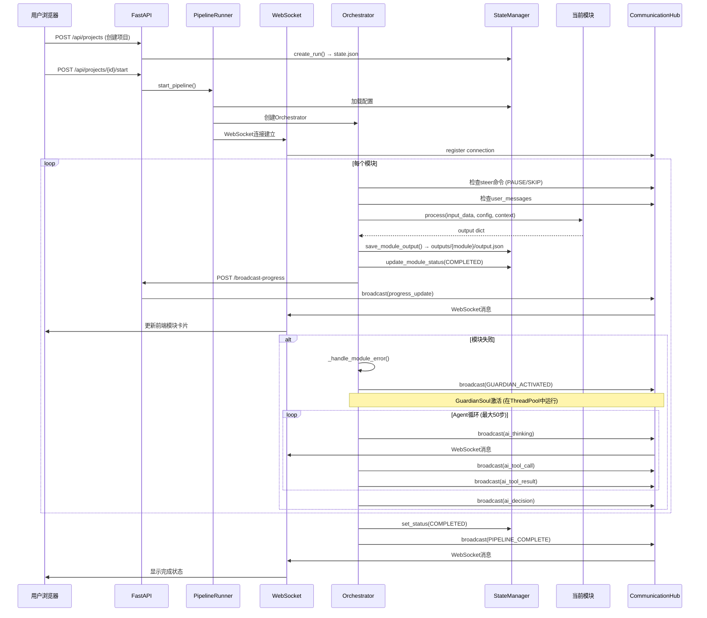
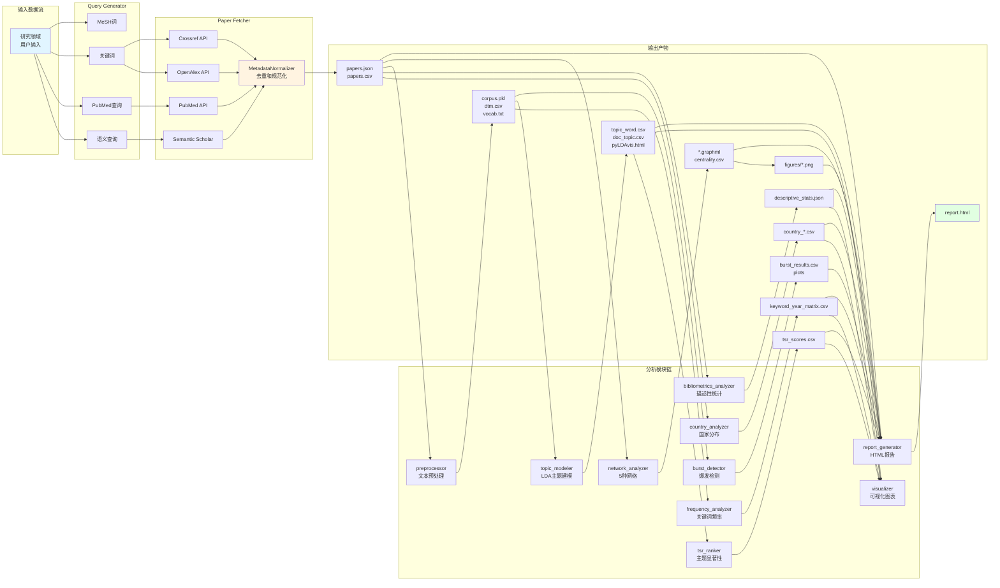
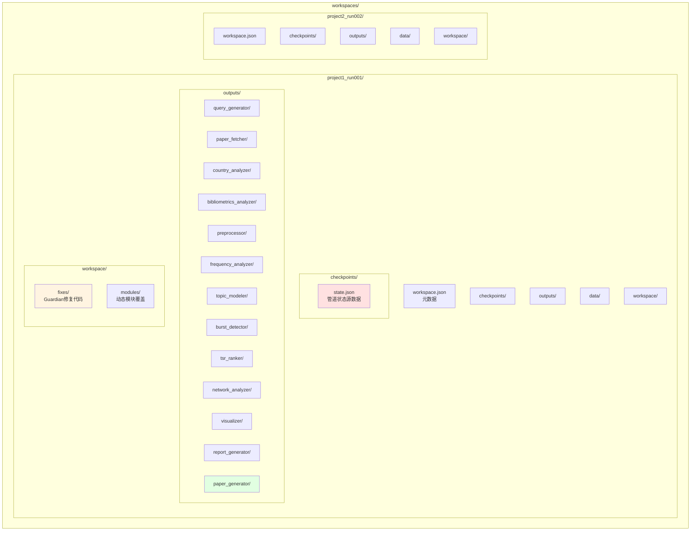
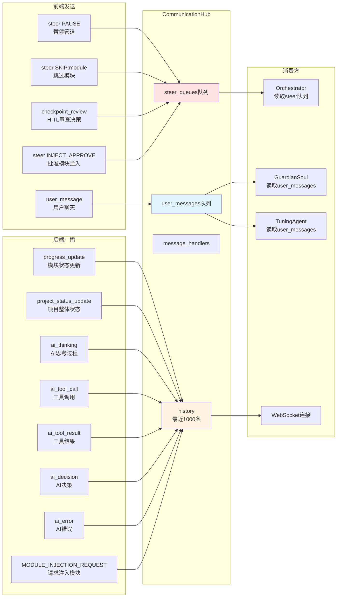
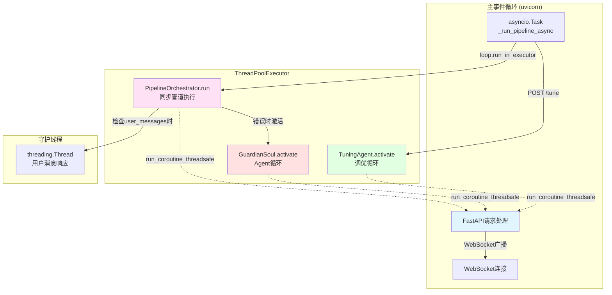
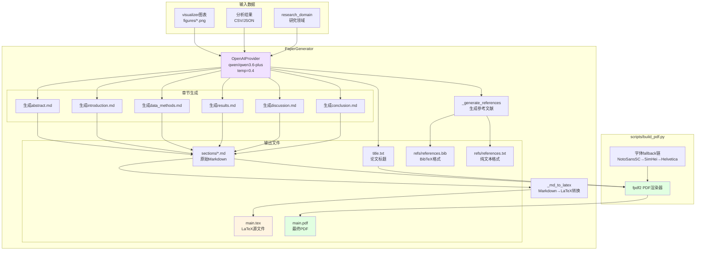
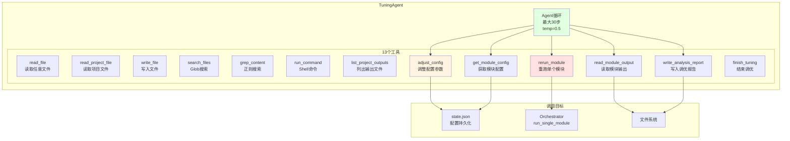
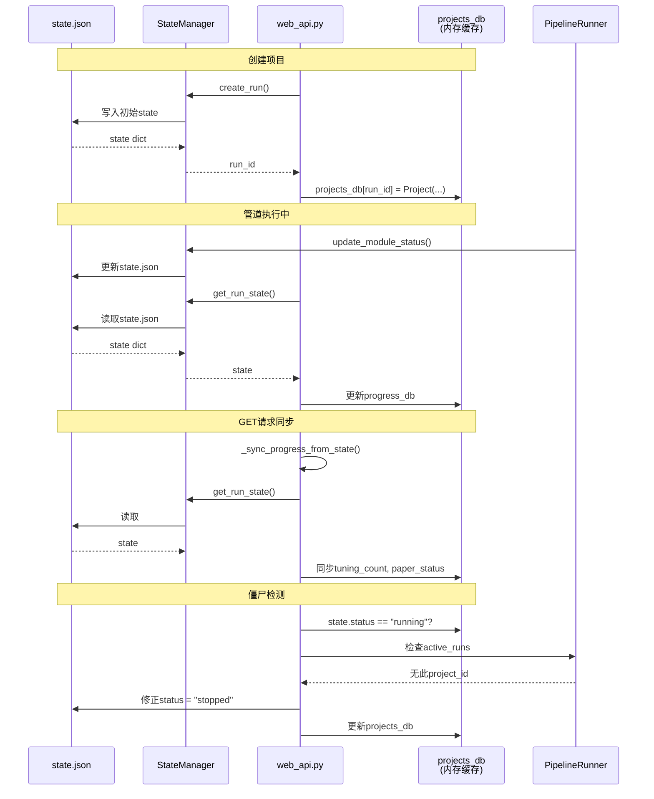
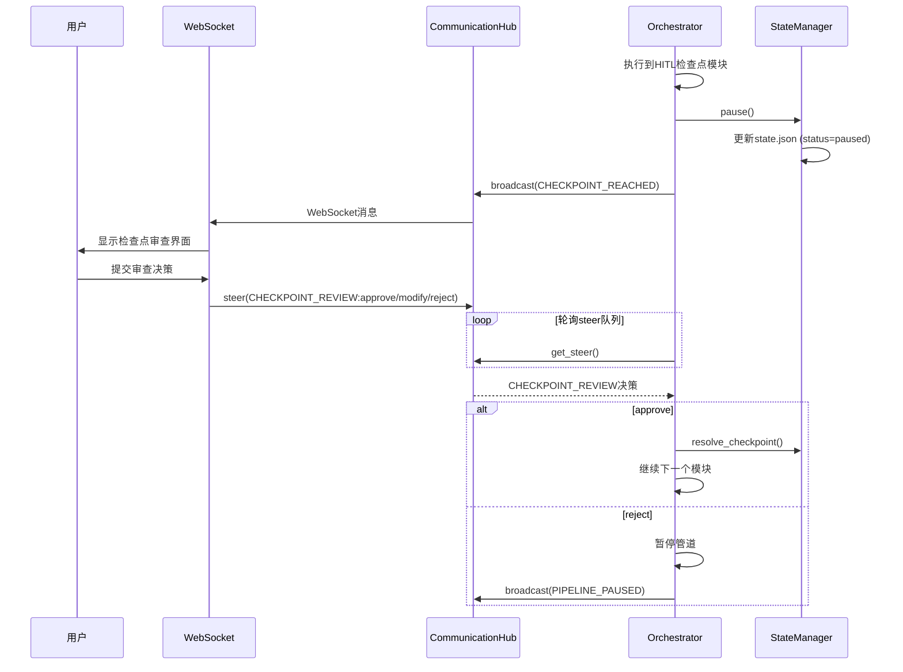
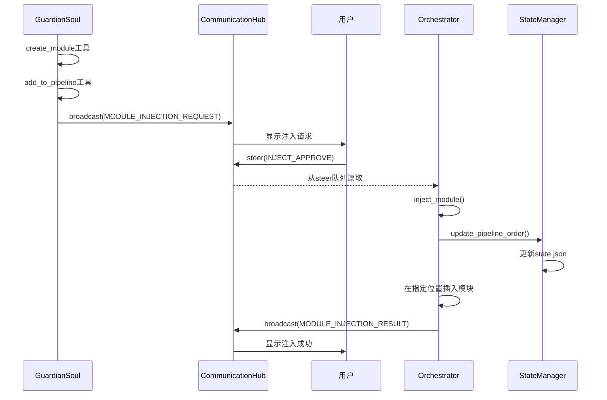

# Bibliometrics Agent 系统架构图

## 1. 总体系统架构

```mermaid
graph TB
    subgraph "用户层"
        Browser[浏览器<br/>static/index.html]
    end

    subgraph "Web服务层"
        FastAPI[FastAPI Server<br/>web_api.py<br/>:8001]
        WS[WebSocket<br/>/ws/{project_id}]
        CM[ConnectionManager<br/>HTTP连接管理]
        Hub[CommunicationHub<br/>消息路由中心]
    end

    subgraph "业务逻辑层"
        Runner[PipelineRunner<br/>全局单例<br/>active_runs字典]
        Orchestrator[PipelineOrchestrator<br/>模块执行编排]
        GuardianSoul[GuardianSoul<br/>LLM错误恢复Agent<br/>最大50步]
        TuningAgent[TuningAgent<br/>LLM调优Agent<br/>最大30步]
    end

    subgraph "数据持久层"
        StateMgr[StateManager<br/>state.json持久化]
        WorkspaceMgr[WorkspaceManager<br/>项目工作空间隔离]
        Logger[ProjectLogger<br/>日志系统]
    end

    subgraph "模块层"
        Registry[ModuleRegistry<br/>模块自动发现]
        subgraph "12个分析模块"
            M1[query_generator]
            M2[paper_fetcher]
            M3[country_analyzer]
            M4[bibliometrics_analyzer]
            M5[preprocessor]
            M6[frequency_analyzer]
            M7[topic_modeler]
            M8[burst_detector]
            M9[tsr_ranker]
            M10[network_analyzer]
            M11[visualizer]
            M12[report_generator]
        end
        M13[paper_generator<br/>v2.0.0]
    end

    subgraph "LLM服务"
        LLMProvider[OpenAIProvider<br/>OpenRouter API<br/>qwen/qwen3.6-plus]
        LLMConfig[configs/default.yaml]
    end

    subgraph "外部数据源"
        PubMed[PubMed API]
        OpenAlex[OpenAlex API]
        Crossref[Crossref API]
        SemScholar[Semantic Scholar]
    end

    %% 用户交互
    Browser -->|HTTP请求| FastAPI
    Browser <-.->|WebSocket| WS
    WS --> Hub
    FastAPI --> CM

    %% API路由
    FastAPI --> Runner
    FastAPI --> StateMgr

    %% Pipeline执行
    Runner -->|start_pipeline| Orchestrator
    Runner -->|active_runs| Orchestrator
    Orchestrator --> Registry

    %% 模块执行流程
    Orchestrator --> M1
    M1 --> M2
    M2 --> M3
    M3 --> M4
    M4 --> M5
    M5 --> M6
    M6 --> M7
    M7 --> M8
    M8 --> M9
    M9 --> M10
    M10 --> M11
    M11 --> M12

    %% 数据获取
    M2 --> PubMed
    M2 --> OpenAlex
    M2 --> Crossref
    M2 --> SemScholar

    %% 错误处理
    Orchestrator -->|on error| GuardianSoul
    GuardianSoul --> LLMProvider

    %% 调优
    FastAPI -->|POST /tune| TuningAgent
    TuningAgent --> LLMProvider
    TuningAgent -->|rerun_module| Orchestrator

    %% 论文生成
    FastAPI -->|POST /generate-paper| M13
    M13 --> LLMProvider

    %% 状态持久化
    Orchestrator --> StateMgr
    Runner --> StateMgr
    StateMgr -->|state.json| WorkspaceMgr

    %% 消息广播
    Orchestrator -->|broadcast_progress| Hub
    GuardianSoul -.->|run_coroutine_threadsafe| Hub
    TuningAgent -.->|run_coroutine_threadsafe| Hub
    Hub -->|WebSocket| Browser

    %% 配置
    LLMConfig --> LLMProvider
    LLMConfig --> Orchestrator

    style Browser fill:#e1f5ff
    style FastAPI fill:#fff4e1
    style Orchestrator fill:#ffe1f5
    style GuardianSoul fill:#ffe1e1
    style TuningAgent fill:#e1ffe1
    style LLMProvider fill:#f0e1ff
```

## 2. Pipeline执行流程（详细）



## 3. GuardianSoul Agent循环

```mermaid
stateDiagram-v2
    [*] --> 激活: 模块错误

    激活 --> 构建上下文: 加载project context<br/>错误报告

    构建上下文 --> Agent循环: 初始messages

    state Agent循环 {
        [*] --> 检查停止请求

        检查停止请求 --> 广播步骤: stop_requested?
        广播步骤 --> 检查用户消息: broadcast(step_start)
        检查用户消息 --> LLM调用: 读取user_messages队列

        LLM调用 --> 处理响应: llm.chat(messages, tools)

        处理响应 --> 广播思考: content
        广播思考 --> 执行工具调用: tool_calls?

        执行工具调用 --> 广播工具: 执行10个工具之一
        广播工具 --> 检查finish: broadcast(tool_result)

        检查finish --> Agent循环: 继续循环
        检查finish --> 返回决策: finish决策

        广播工具 --> 达到最大步数: 步数 < 50
        达到最大步数 --> 返回决策
    }

    返回决策 --> [*]: GuardianDecision

    note right of Agent循环
        10个工具:
        1. read_file
        2. read_project_file
        3. write_file
        4. search_files
        5. grep_content
        6. run_command
        7. generate_fix
        8. finish
        9. create_module
        10. add_to_pipeline
    end note
```

## 4. 数据流和状态持久化



## 5. 工作空间隔离结构



## 6. WebSocket消息类型和流向



## 7. 线程和异步模式



## 8. Paper Generator v2.0.0 工作流程



## 9. Tuning Agent 工具集



## 10. 状态同步机制



## 11. HITL (Human-in-the-Loop) 检查点流程



## 12. 模块注入流程



---

## 关键设计决策

### 1. 三层架构
- **Web层**: FastAPI + WebSocket 处理HTTP请求和实时通信
- **业务层**: PipelineRunner + Orchestrator + Agents 处理管道执行和智能决策
- **数据层**: StateManager + WorkspaceManager 保证状态持久化和工作空间隔离

### 2. 混合同步/异步模式
- **主事件循环**: 异步处理HTTP和WebSocket
- **ThreadPoolExecutor**: 同步管道执行避免阻塞主循环
- **跨线程通信**: `run_coroutine_threadsafe` 实现Agent到WebSocket的广播

### 3. 状态一致性
- **源数据**: `state.json` 是唯一可信源
- **内存缓存**: `projects_db` 和 `progress_db` 仅用于快速访问,必须通过 `_sync_progress_from_state()` 同步
- **僵尸检测**: 定期检查 `state.json` 说运行但 `active_runs` 中不存在的项目

### 4. Guardian覆盖机制
- **workspace/modules/{module}.py**: Guardian生成的修复代码
- **动态加载**: `_get_module_with_workspace_override()` 优先加载workspace版本
- **隔离性**: 修复代码不修改系统源码,只在项目工作空间内生效

### 5. 消息路由中心
- **CommunicationHub**: 单例模式,管理所有WebSocket连接和消息队列
- **队列分离**: `user_messages` (用户聊天) 和 `steer_queues` (控制命令) 分离
- **历史记录**: 保留最近1000条消息,超过500条时修剪

### 6. 错误恢复策略
- **Strategy 1**: GuardianSoul (LLM驱动,50步限制,10个工具)
- **Strategy 2**: Template GuardianAgent (模板驱动,离线修复)
- **降级机制**: LLM不可用时自动降级到模板修复
